# neg2pos-vangogh-pix2pix-dls

Реализация pix2pix для финального проека DLS. Решаемая задача - из негатива
фотографии сгенерировать RGB-картинку с примесью живописи Ван Гога (модель обучена на негативах 
картин Ван Гога).

## Модели

* модель генератора - UNet из домашней работы по семантической сегментации с добавление 
LeakyReLU.
* модель дискриминатора - дискриминатор из домашки по GAN с добавлением LeakyReLU, фактически часть
энкодера модели SegNet.

## Утилиты 

### Визуализация и загрузка данных

Была взята из репозитория https://github.com/znxlwm/pytorch-pix2pix 
с некоторыми доработками под мой проект.
Классы **dataload/data_loader.py** и **utils/visualizer.py**.

### Генератор датасетов

Самописный класс **utils/images_concat.py**. 
Берет 2 набора картинок и склеивает их поэлементно, приводя 
к фомату 256*512.

Пример использования:
```bash
python images_concat.py --fold_A data/concat/monet_neg --fold_B data/concat/monet_or --fold_AB data/concat/res
```

Примеры картинок в папке **data/concat**.

## Тренировка
Скрипт **train_loop.py**. Пример строки запуска:
```bash
python train_loop.py --dataset dataset --batch_size batch_size --n_epochs n_epochs
```

Запускает процесс обучения со следующими шагами:
1. Ищет датасет в директории **data/dataset**. Должна быть тренировочная 
и тестовая часть (см. пример в папке **data**). Все картинки приводятся к
разрешению 256*256.
2. Сам цикл обучения.
3. В папку **learning_result/dataset** каждую эпоху дампится картинка 
с результатами генерации из 5 примеров тестовой выборки.
4. По окончании n_epochs сохраняется state_dict моделей в папку 
**models_state_dicts/dataset**.

## Решаемые задачи

### Промежуточная задача: facades
Решенная задача facades послужила в качестве 
площадки для настройки моделей. 400 тренировочных картинок,
200 эпох, 32 картинки в батче.

Результаты обучения лежат в **learning_result/facades**, веса модели в 
**models_state_dicts/facades**.

Результат после 200 эпох.

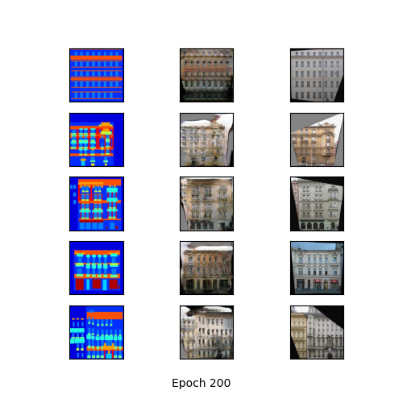

Видно, что в целом модель обучилась, но остаются артефакты. Наблюдается 
эффект переобучения, если посмотреть картинки по эпохам. 

Если посмотреть картинки 
по эпохам можно заметить, что примерно с 50 эпохи модель стала
добавлять много размытия на тестовых примерах, т.е. ее лучше было 
остановить пораньше. Тем не менее, полученный результат позволяет 
заключить, что модели справляются со своими задачами и их можно
использовать для решения основной задачи.

### Основная задача: neg2pos-vangogh
Основной задачей была выбрана следующая - восстановить из негатива
фотографий картин Ван Гога оригинал. Оригиналы были взяти из
датасета vangogh2photo, негативы получены с помощью
фотошопа и склеины скриптом **util/images_concat.py** (пример
запуска выше).

В тренировочной выборке 300 картинок Ван Гога.
В тестовой выборке по 50 картинок Ван Гога и Моне (из датасета 
monet2photo. Было интересно, насколько хорошо восстановится картина Моне).

Также обучалось 200 эпох, батч 32 картинки.

Результаты следующие (state_dict и картинки по эпохам сохранены в репозитории).

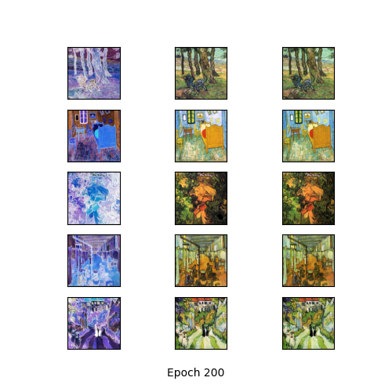

С помощью выбранной архитектуры сетей задача отлично решается.
Видно, что хорошо восстанавливаюся как картины Ван Гога, так и картины 
Моне. Также с помощью генератора картинок провери полученных результат
на случайных картинках из интернета.

## Генерация картинок
Скрипт **neg2pos_vangogh_generator.py**. Пример строки запуска:
```bash
python neg2pos_vangogh_generator.py --image_path path_to_image
```

Загружается **state_dict** модели neg2pos-vangogh (в случае отсутвия модели в
папке **models_state_dicts/neg2pos-vangogh** бросает исключение). 
По указанному пути **path_to_image** находится необходимое 
изображение, прогоняется через генератор, результат сохраняется в 
**generated_pics**, ему присваивается рандомное имя. 
Примеры исходных изображений лежат в 
**source_images_for_generator**.

### Генерация картин Моне

Уже на тренировке было видно, что модель хорошо справляется с задачей
восстановления картин Моне. На отложенной выборке также были проверены
пара картин.

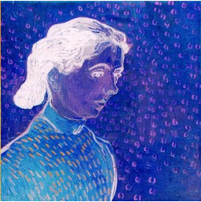
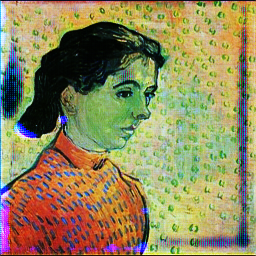

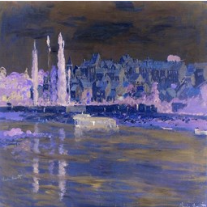
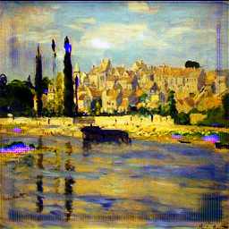


### Генерация картинок из интернета

Хороший результат получается и для случайных картинок из интернета. Видно, что картинки
восстанавливаются в нормальные похожие на реальность картинки с добавлением палитры,
характерной для работ Ван Гога.

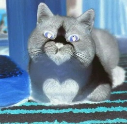
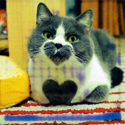


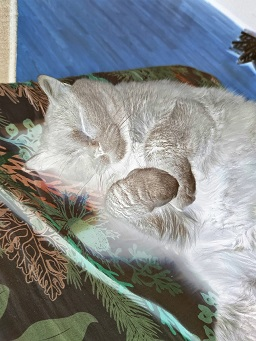
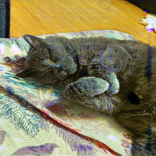

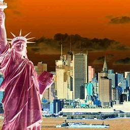
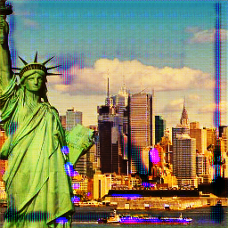


Размеры исходных картинок были изменены исключительно в угоду markdown, можно 
применять для картинок любого размера =)